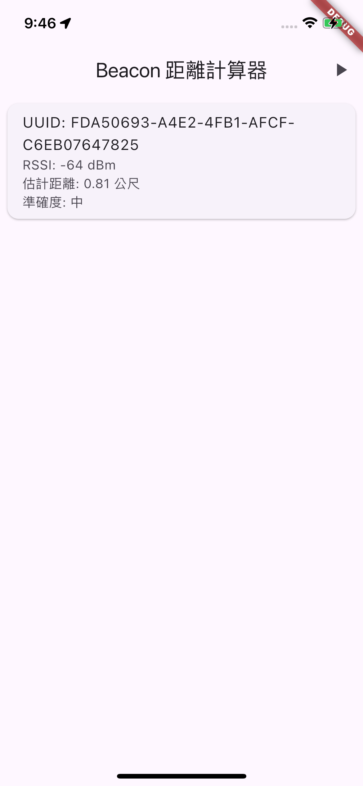
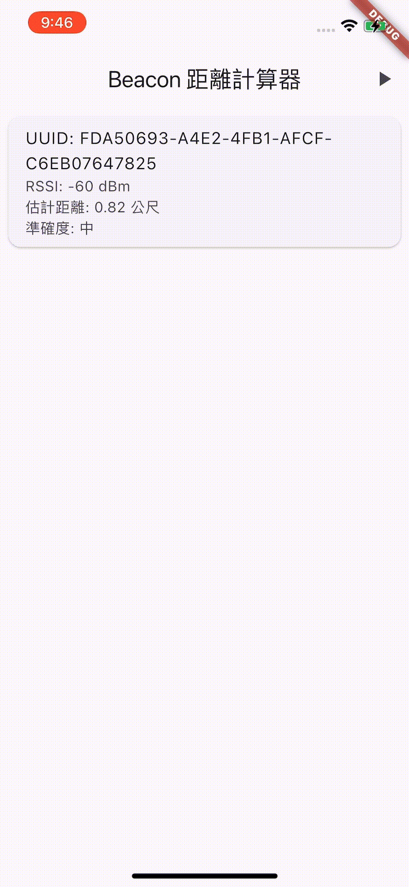

# flutter_beacon

A new Flutter project.

## Getting Started

This project is a scan ibeacon for a Flutter application.

## Sample

```Dart
     final beaconScannerPlugin = BeaconScannerPlugin();
     await beaconScannerPlugin.init();
     await beaconScannerPlugin.startMonitoringRegion();
     beaconScannerPlugin.onBeaconsRanged = (beacons) {
       if (mounted) {
         final beaconData = beacons
             .map((result) => BeaconData(
                   uuid: result.proximityUUID,
                   rssi: result.rssi,
                   distance: result.accuracy,
                 ))
             .toList();
         setState(() {
           _beacons = beaconData;
         });
       }
     }
```


## More screenshots
| **screenshots** | **video** 
| ------------- | ------------- 
||